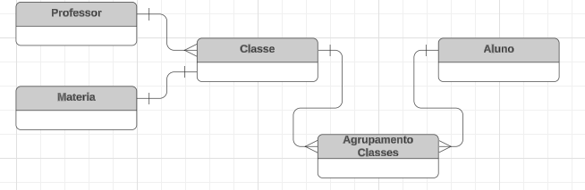
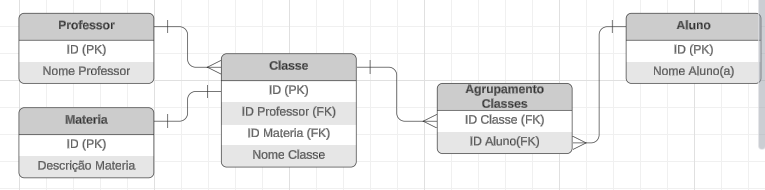
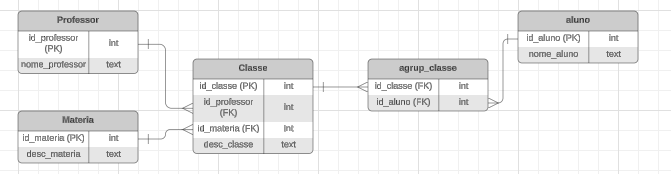

### Descrição do Projeto de Modelagem de Dados

#### Objetivo do Projeto

O objetivo deste projeto é transformar os dados da Escola ABC, atualmente gerenciados em planilhas Excel, para uma arquitetura de banco de dados mais robusta e escalável, utilizando o PostgreSQL. A modelagem dos dados será realizada seguindo as melhores práticas de normalização, especificamente a Terceira Forma Normal (3NF), para garantir a integridade e a consistência dos dados.

#### Passos para a Modelagem dos Dados

1.  **Análise dos Dados Existentes:**
    
    -   Revisar as planilhas Excel para entender a estrutura atual dos dados e identificar todas as entidades e relacionamentos necessários.
2.  **Definição do Esquema de Banco de Dados:**
    
    -   Criar um esquema que reflita todas as entidades identificadas (por exemplo, turmas, professores, matérias e estudantes) e seus relacionamentos.
3.  **Normalização dos Dados:**
    
    -   Aplicar as regras de normalização até a 3NF para evitar redundâncias, eliminar anomalias de inserção, atualização e exclusão, e garantir que cada tabela armazene dados de uma única entidade.
4.  **Criação das Tabelas no PostgreSQL:**
    
    -   Escrever scripts SQL para criar as tabelas normalizadas no banco de dados PostgreSQL.
    -   Definir chaves primárias, estrangeiras e outros constraints necessários para manter a integridade referencial dos dados.
5.  **Importação dos Dados:**
    
    -   Desenvolver scripts para importar os dados das planilhas Excel para as tabelas do PostgreSQL.
    -   Validar a integridade e a consistência dos dados importados.
6.  **Materialização dos Dados:**
    
    -   Criar views ou tabelas materializadas, se necessário, para facilitar consultas e relatórios, melhorando o desempenho e a acessibilidade dos dados.

#### Benefícios de Utilizar a Terceira Forma Normal (3NF)

A 3NF é uma etapa de normalização que oferece vários benefícios importantes para a modelagem de dados, especialmente em um ambiente educacional como o da Escola ABC:

1.  **Eliminação de Redundâncias:**
    
    -   A 3NF garante que todos os atributos de uma tabela dependam apenas da chave primária, eliminando redundâncias desnecessárias. Isso reduz o uso de armazenamento e melhora a eficiência das operações de banco de dados.
2.  **Integridade dos Dados:**
    
    -   A normalização até a 3NF assegura que os dados estejam bem organizados e que as relações entre tabelas sejam claramente definidas. Isso facilita a manutenção da integridade referencial e a consistência dos dados.
3.  **Flexibilidade para Alterações:**
    
    -   Com dados normalizados, torna-se mais fácil fazer alterações na estrutura do banco de dados sem afetar outras partes do sistema. Por exemplo, adicionar uma nova matéria ou um novo professor não exige modificações complexas.
4.  **Eficiência nas Consultas:**
    
    -   A 3NF ajuda a otimizar consultas ao garantir que cada tabela contenha apenas dados relacionados a uma única entidade. Isso simplifica as junções (joins) e melhora o desempenho das consultas.
5.  **Minimização de Anomalias:**
    
    -   A 3NF ajuda a prevenir anomalias de inserção, atualização e exclusão, assegurando que as operações no banco de dados sejam executadas de maneira consistente e confiável.

### Exemplo de Modelagem em 3NF

Aqui está um exemplo simplificado de como os dados da Escola ABC poderiam ser modelados em 3NF:

- **Conceitual**

 

- **Lógico**

 

- **Físico**

 